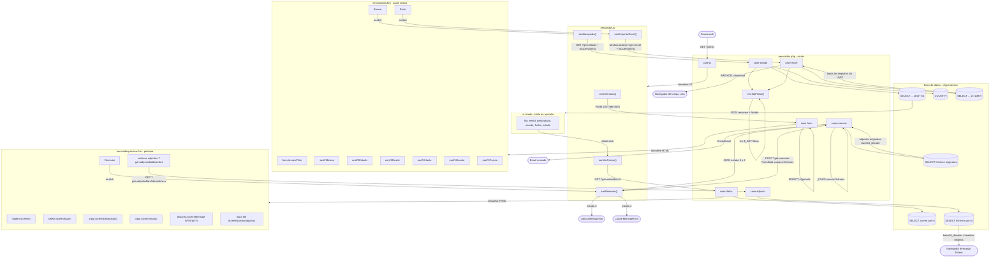

# Flujo completo — ADMINEENVIADOS

```mermaid
flowchart TD

    FW(["Framework"]) -->|"GET ?get=js"| JS_CASE

    subgraph PHP ["eenviados.php - router"]
        JS_CASE["case js"]
        FORM_CASE["case form"]
        LISTADO_CASE["case listado"]
        DATOS_CASE["case datos"]
        ADJUNTO_CASE["case adjunto"]
        REENVIAR_CASE["case reenviar"]
        EXCEL_CASE["case excel"]
        FILTROS["eenSqlFiltros()"]
    end

    subgraph BD ["Base de datos - cfgemailsenv"]
        DB_LIST[("SELECT ... LIMIT 50")]
        DB_COUNT[("COUNT(*)")]
        DB_DATOS[("SELECT correo por id")]
        DB_ADJ[("SELECT ficheros por id")]
        DB_EXCEL[("SELECT ... sin LIMIT")]
        DB_REENV[("SELECT ficheros originales")]
    end

    JS_CASE -->|"devuelve JS"| JSFILE

    subgraph JSFILE ["eenviados.js"]
        CREAR["crearVentana()"]
        BUSQUEDA["eenBusqueda()"]
        VERCORREO["eenVerCorreo()"]
        REENVIAR["eenReenviar()"]
        EXCEL_JS["eenExportarExcel()"]
    end

    CREAR -->|"Panel sUrl ?get=form"| FORM_CASE
    FORM_CASE -->|"SELECT cfgemails"| FORM_CASE
    FORM_CASE -->|"devuelve HTML"| FRM_FIL

    subgraph FRM_FIL ["eenviadosfil.frm - panel lateral"]
        FORM_EL["form id=eenFiltro"]
        INP_BUZON["eenFilBuzon"]
        INP_ESTADO["eenFilEstado"]
        INP_DESDE["eenFilDesde"]
        INP_HASTA["eenFilHasta"]
        INP_ASUNTO["eenFilAsunto"]
        INP_CORREO["eenFilCorreo"]
        BTN_BUSCAR["Buscar"]
        BTN_EXCEL["Excel"]
    end

    BTN_BUSCAR -->|"onclick"| BUSQUEDA
    BUSQUEDA -->|"GET ?get=listado + toQueryString"| LISTADO_CASE
    LISTADO_CASE --> FILTROS
    FILTROS -->|"lee $_GET filtros"| FILTROS
    LISTADO_CASE --> DB_COUNT
    LISTADO_CASE --> DB_LIST
    DB_LIST -->|"JSON resumen + listado"| TABLA

    subgraph TABLA ["cListado - tabla en pantalla"]
        FILA["fila: eenId, destinatario, asunto, fecha, estado"]
    end

    FILA -->|"doble click"| VERCORREO
    VERCORREO -->|"GET ?get=datos&id=N"| DATOS_CASE
    DATOS_CASE --> DB_DATOS
    DATOS_CASE -->|"devuelve HTML"| FRM_PREV

    subgraph FRM_PREV ["eenviadospreview.frm - pestana"]
        HIDDEN["hidden id=eenId"]
        SEL_BUZ["select id=eenBuzon"]
        INP_DEST["input id=eenDestinatario"]
        INP_ASUN["input id=eenAsunto"]
        INP_MENS["textarea id=eenMensaje WYSIWYG"]
        LINKS_ADJ["enlaces adjuntos ?get=adjunto&id&nombre"]
        INP_FILE["input file id=eenNuevosAdjuntos"]
        BTN_REENV["Reenviar"]
    end

    LINKS_ADJ -->|"GET ?get=adjunto&id=N&nombre=x"| ADJUNTO_CASE
    ADJUNTO_CASE --> DB_ADJ
    DB_ADJ -->|"base64_decode + headers binarios"| DESCARGA_ADJ(["Navegador descarga fichero"])

    BTN_REENV -->|"onclick"| REENVIAR
    REENVIAR -->|"POST ?get=reenviar FormData campos+ficheros"| REENVIAR_CASE
    REENVIAR_CASE --> DB_REENV
    DB_REENV -->|"adjuntos originales base64_decode"| REENVIAR_CASE
    REENVIAR_CASE -->|"_FILES nuevos ficheros"| REENVIAR_CASE
    REENVIAR_CASE -->|"EnviarEmail"| EMAIL(["Email enviado"])
    REENVIAR_CASE -->|"JSON estado 0 o 2"| REENVIAR
    REENVIAR -->|"estado 0"| MSG_OK(["LanzarMensajeInfo"])
    REENVIAR -->|"estado 2"| MSG_ERR(["LanzarMensajeError"])

    BTN_EXCEL -->|"onclick"| EXCEL_JS
    EXCEL_JS -->|"window.location ?get=excel + toQueryString"| EXCEL_CASE
    EXCEL_CASE --> FILTROS
    EXCEL_CASE --> DB_EXCEL
    DB_EXCEL -->|"todos los registros sin LIMIT"| EXCEL_CASE
    EXCEL_CASE -->|"INFEXCEL download"| DESCARGA_XLS(["Navegador descarga .xlsx"])
```
